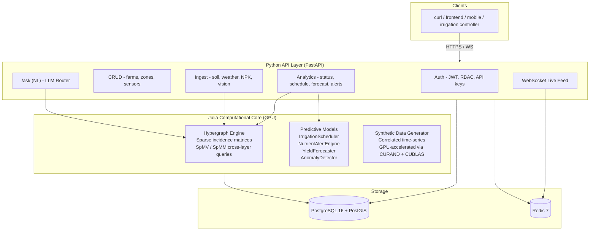

# AgriSense

**Agricultural hypergraph API** — models farms as layered hypergraphs with a **GPU-accelerated Julia computational core** (CUDA.jl + KernelAbstractions.jl) for irrigation scheduling, nutrient management, yield forecasting, and an LLM-powered natural language query interface. Built with FastAPI, PostgreSQL + PostGIS, Redis, and a Julia ↔ Python bridge via `juliacall`.

> Uses synthetic sensor data modeled on real-world agricultural patterns. Production deployment at Field Partner SARL uses proprietary client data under NDA.

---

## Architecture



### Layered Hypergraph Model

The farm is modeled as `H = (V, E)` where vertices represent physical entities and hyperedges connect arbitrary subsets of vertices across 7 typed layers:

| Layer | Data Source | GPU Operation |
|---|---|---|
| **Soil** | Moisture, temperature, EC, pH sensors (15-min) | SpMV feature aggregation |
| **Irrigation** | Valve state, flow rate, schedule events | Batch water balance kernel |
| **Solar/Lighting** | PAR, DLI, photoperiod (open field + greenhouse) | Broadcasting on CuArray |
| **Weather** | Temperature, humidity, rainfall, wind, ET₀ | Correlated random generation |
| **Crop Requirements** | Growth stage profiles, water/light/NPK needs | Static lookup + GPU scoring |
| **NPK** | Nitrogen, phosphorus, potassium samples | Deficit kernel (KernelAbstractions) |
| **Computer Vision** | Pest/disease/wilting detection from cameras | Stochastic anomaly SpMV |

Cross-layer queries (e.g., irrigation decision = soil × weather × crop × valve) are expressed as **sparse matrix multiplications** (`B_a' * B_b`) on GPU via CUSPARSE.

---

## Quickstart

```bash
# Clone
git clone https://github.com/mehdiskouri/agrisense.git
cd agrisense

# Copy environment variables
cp .env.example .env

# Start everything (PostgreSQL, Redis, API, seed data)
docker compose up --build

# API is live at http://localhost:8000
# Swagger docs at http://localhost:8000/docs
```

### Development (local)

```bash
# Install Python + Julia dependencies
make install

# Run migrations
make migrate

# Seed demo data
make seed

# Start dev server with hot reload
make dev

# Run tests
make test        # Python
make test-julia  # Julia
make test-all    # Both
```

---

## GPU Setup

AgriSense uses **Julia + CUDA.jl + KernelAbstractions.jl** for GPU acceleration. The same code runs on CPU when no GPU is available.

| Environment | GPU Behaviour |
|---|---|
| **Local with NVIDIA GPU** | Automatically detects and uses CUDA |
| **Docker with `--gpus all`** | GPU pass-through via nvidia-container-toolkit |
| **CI (GitHub Actions)** | Falls back to CPU — all tests pass without GPU |
| **No GPU available** | KernelAbstractions dispatches to `CPU()` backend |

To enable GPU in Docker Compose, uncomment the `deploy.resources` block in `docker-compose.yml`.

---

## API Endpoints

| Group | Method | Path | Description |
|---|---|---|---|
| **System** | GET | `/health` | Health check |
| **Farms** | POST | `/api/v1/farms` | Create farm |
| | GET | `/api/v1/farms/{id}` | Get farm + topology |
| | GET | `/api/v1/farms/{id}/graph` | Full hypergraph structure |
| **Ingest** | POST | `/api/v1/ingest/soil` | Batch soil readings |
| | POST | `/api/v1/ingest/weather` | Weather data |
| | POST | `/api/v1/ingest/irrigation` | Irrigation event |
| | POST | `/api/v1/ingest/npk` | Nutrient samples |
| | POST | `/api/v1/ingest/vision` | CV inference results |
| **Analytics** | GET | `/api/v1/analytics/{id}/status` | Farm status |
| | GET | `/api/v1/analytics/{id}/irrigation/schedule` | 7-day schedule |
| | GET | `/api/v1/analytics/{id}/yield/forecast` | Yield prediction |
| | GET | `/api/v1/analytics/{id}/alerts` | Active alerts |
| **NL Query** | POST | `/api/v1/ask/{id}` | Natural language question |
| **WebSocket** | WS | `/ws/{id}/live` | Real-time sensor feed |

---

## Tech Stack

| Component | Technology |
|---|---|
| API Framework | FastAPI (Python 3.12) |
| Compute Core | Julia 1.11 + CUDA.jl + KernelAbstractions.jl |
| Database | PostgreSQL 16 + PostGIS |
| Cache / PubSub | Redis 7 |
| ORM | SQLAlchemy 2.0 (async) + Alembic |
| LLM | Anthropic Claude API |
| Auth | JWT + RBAC + API keys |
| CI | GitHub Actions |
| Container | Docker + docker-compose |

---

## Project Structure

```
agrisense/
├── app/                          # Python API layer
│   ├── main.py                   # FastAPI app + lifespan
│   ├── config.py                 # pydantic-settings
│   ├── database.py               # async SQLAlchemy engine
│   ├── auth/                     # JWT, RBAC, API key auth
│   ├── models/                   # SQLAlchemy ORM models
│   ├── schemas/                  # Pydantic request/response
│   ├── routes/                   # FastAPI routers
│   ├── services/                 # Business logic + Julia bridge
│   └── middleware/               # Rate limiting, logging
├── core/AgriSenseCore/           # Julia GPU compute package
│   ├── src/
│   │   ├── AgriSenseCore.jl      # Module entry + GPU backend selection
│   │   ├── types.jl              # FarmProfile, HyperGraphLayer structs
│   │   ├── hypergraph.jl         # build, query, cross_layer (SpMV/SpMM)
│   │   ├── models/               # irrigation, nutrients, yield, anomaly
│   │   ├── synthetic/            # GPU-accelerated data generation
│   │   └── bridge.jl             # Python-facing API (Dict in/out, GPU internal)
│   └── test/
├── alembic/                      # Database migrations
├── scripts/                      # seed_db.py, demo_queries.sh
├── tests/                        # pytest suite
├── Dockerfile                    # Multi-stage: Julia precompile → Python → runtime
├── docker-compose.yml            # postgres + redis + api + seed
└── Makefile                      # dev, test, lint, migrate, docker-up
```

---

## License

MIT
