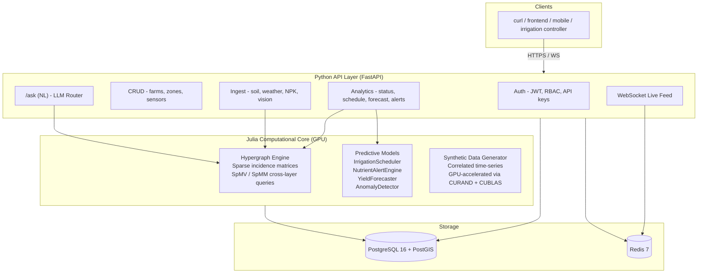

# AgriSense

**Agricultural hypergraph API** — models farms as layered hypergraphs with a **GPU-accelerated Julia computational core** (CUDA.jl + KernelAbstractions.jl) for irrigation scheduling, nutrient management, yield forecasting, and an LLM-powered natural language query interface. Built with FastAPI, PostgreSQL + PostGIS, Redis, and a Julia ↔ Python bridge via `juliacall`.

> Uses synthetic sensor data modeled on real-world agricultural patterns. Production deployment at Field Partner SARL uses proprietary client data under NDA.

---

## Architecture


```mermaid
graph TB
    subgraph Clients
        A[curl / frontend / mobile / irrigation controller]
    end

    subgraph API["Python API Layer (FastAPI)"]
        B[Auth - JWT, RBAC, API keys]
        C[CRUD - farms, zones, sensors]
        D[Ingest - soil, weather, NPK, vision]
        E[Analytics - status, schedule, forecast, alerts]
        F["/ask (NL) - LLM Router"]
        G[WebSocket Live Feed]
    end

    subgraph Julia["Julia Computational Core (GPU)"]
        H[Hypergraph Engine<br/>Sparse incidence matrices<br/>SpMV / SpMM cross-layer queries]
        I[Predictive Models<br/>IrrigationScheduler<br/>NutrientAlertEngine<br/>YieldForecaster<br/>AnomalyDetector]
        J[Synthetic Data Generator<br/>Correlated time-series<br/>GPU-accelerated via CURAND + CUBLAS]
    end

    subgraph Storage
        K[(PostgreSQL 16 + PostGIS)]
        L[(Redis 7)]
    end

    A -->|HTTPS / WS| API
    E --> H
    E --> I
    D --> H
    F --> H
    G --> L
    API --> K
    API --> L
    Julia --> K
```

### Layered Hypergraph Model

The farm is modeled as `H = (V, E)` where vertices represent physical entities and hyperedges connect arbitrary subsets of vertices across 7 typed layers:

| Layer | Data Source | GPU Operation |
|---|---|---|
| **Soil** | Moisture, temperature, EC, pH sensors (15-min) | SpMV feature aggregation |
| **Irrigation** | Valve state, flow rate, schedule events | Batch water balance kernel |
| **Solar/Lighting** | PAR, DLI, photoperiod (open field + greenhouse) | Broadcasting on CuArray |
| **Weather** | Temperature, humidity, rainfall, wind, ET₀ | Correlated random generation |
| **Crop Requirements** | Growth stage profiles, water/light/NPK needs | Static lookup + GPU scoring |
| **NPK** | Nitrogen, phosphorus, potassium samples | Deficit kernel (KernelAbstractions) |
| **Computer Vision** | Pest/disease/wilting detection from cameras | Stochastic anomaly SpMV |

Cross-layer queries (e.g., irrigation decision = soil × weather × crop × valve) are expressed as **sparse matrix multiplications** (`B_a' * B_b`) on GPU via CUSPARSE.

---

## Quickstart

```bash
# Clone
git clone https://github.com/mehdiskouri/agrisense.git
cd agrisense

# Copy environment variables
cp .env.example .env

# Start everything (PostgreSQL, Redis, API, seed data)
docker compose up --build

# API is live at http://localhost:8000
# Swagger docs at http://localhost:8000/docs
# Readiness checks at http://localhost:8000/health/ready
```

Compose flow runs migrations before API startup and gates seed execution on API readiness.

### Running inside an existing container (e.g., Vast.ai template)

If you are already inside a containerized workspace, the `docker` daemon/CLI may be unavailable inside that shell.

- Run `docker compose` from the host environment that has Docker daemon access.
- Or use local development mode directly inside the workspace container:

```bash
make install
make migrate
make seed
make dev
```

### Development (local)

```bash
# Install Python + Julia dependencies
make install

# Run migrations
make migrate

# Seed demo data
make seed

# Start dev server with hot reload
make dev

# Run tests
make test        # Python
make test-julia  # Julia
make test-all    # Both
```

---

## GPU Setup

AgriSense uses **Julia + CUDA.jl + KernelAbstractions.jl** for GPU acceleration. The same code runs on CPU when no GPU is available.

| Environment | GPU Behaviour |
|---|---|
| **Local with NVIDIA GPU** | Automatically detects and uses CUDA |
| **Docker with `--gpus all`** | GPU pass-through via nvidia-container-toolkit |
| **CI (GitHub Actions CPU lane)** | Falls back to CPU — all tests pass without GPU |
| **CI (Dedicated GPU lane)** | Runs GPU-focused Julia tests on GPU runner via manual `workflow_dispatch` (`enable_gpu_ci=true`) |
| **No GPU available** | KernelAbstractions dispatches to `CPU()` backend |

Container targets:

```bash
# CPU runtime image (default)
docker build --target runtime-cpu -t agrisense:cpu .

# GPU runtime image
docker build --target runtime-gpu -t agrisense:gpu .
```

For compose GPU execution, switch `api.build.target` to `runtime-gpu` and enable `gpus: all` in `docker-compose.yml`.

---

## API Endpoints

| Group | Method | Path | Description |
|---|---|---|---|
| **System** | GET | `/health` | Health check |
| **System** | GET | `/health/ready` | Deep readiness (DB + Redis + Julia) |
| **Farms** | POST | `/api/v1/farms` | Create farm |
| | GET | `/api/v1/farms/{id}` | Get farm + topology |
| | GET | `/api/v1/farms/{id}/graph` | Full hypergraph structure |
| **Ingest** | POST | `/api/v1/ingest/soil` | Batch soil readings |
| | POST | `/api/v1/ingest/weather` | Weather data |
| | POST | `/api/v1/ingest/irrigation` | Irrigation event |
| | POST | `/api/v1/ingest/npk` | Nutrient samples |
| | POST | `/api/v1/ingest/vision` | CV inference results |
| **Analytics** | GET | `/api/v1/analytics/{id}/status` | Farm status |
| | GET | `/api/v1/analytics/{id}/irrigation/schedule` | 7-day schedule |
| | GET | `/api/v1/analytics/{id}/yield/forecast` | Yield prediction |
| | GET | `/api/v1/analytics/{id}/alerts` | Active alerts |
| | POST | `/api/v1/analytics/{id}/reports/generate` | Generate report download (`xlsx` or `pdf`) |
| | POST | `/api/v1/analytics/{id}/reports/generate/async` | Enqueue async report job (`xlsx` or `pdf`) |
| | GET | `/api/v1/analytics/{id}/reports/jobs/{job_id}` | Check async report job status |
| | GET | `/api/v1/analytics/{id}/reports/jobs/{job_id}/download` | Download async report artifact |
| **NL Query** | POST | `/api/v1/ask/{id}` | Natural language question |
| **WebSocket** | WS | `/ws/{id}/live` | Real-time sensor feed |

---

## Spreadsheet Reports

Report generation supports both synchronous download and asynchronous job workflows.

### Supported formats

- `xlsx` (default): multi-sheet Excel workbook with styled tables and charts.
- `pdf`: compact summary report for quick sharing and preview.

### Sync endpoint behavior

- Endpoint: `POST /api/v1/analytics/{farm_id}/reports/generate`
- Query param: `format=xlsx|pdf` (default `xlsx`)
- Header: `Content-Disposition: attachment; filename="..."`
- Header: `X-Report-Cache: HIT|MISS`

Sync reports are cached in Redis for 15 minutes using a key derived from:

- `farm_id`
- normalized request payload
- selected output format (`xlsx` or `pdf`)

### Async endpoint behavior

- Enqueue: `POST /api/v1/analytics/{farm_id}/reports/generate/async?format=xlsx|pdf`
- Status: `GET /api/v1/analytics/{farm_id}/reports/jobs/{job_id}`
- Download: `GET /api/v1/analytics/{farm_id}/reports/jobs/{job_id}/download`

Async job metadata and report artifacts are stored in Redis with a 6-hour TTL.

### Example usage

```bash
# Sync XLSX (default format)
curl -X POST "$BASE_URL/api/v1/analytics/$FARM_ID/reports/generate" \
    -H "Authorization: Bearer $AUTH_TOKEN" \
    -H "Content-Type: application/json" \
    -d '{"irrigation_horizon_days":7,"include_members":true,"include_history_charts":true}' \
    -D /tmp/report_headers.txt \
    -o agrisense-report.xlsx

# Sync PDF
curl -X POST "$BASE_URL/api/v1/analytics/$FARM_ID/reports/generate?format=pdf" \
    -H "Authorization: Bearer $AUTH_TOKEN" \
    -H "Content-Type: application/json" \
    -d '{"irrigation_horizon_days":7,"include_members":false,"include_history_charts":false}' \
    -o agrisense-report.pdf

# Async enqueue (PDF)
JOB_ID=$(curl -s -X POST "$BASE_URL/api/v1/analytics/$FARM_ID/reports/generate/async?format=pdf" \
    -H "Authorization: Bearer $AUTH_TOKEN" \
    -H "Content-Type: application/json" \
    -d '{"irrigation_horizon_days":7,"include_members":true,"include_history_charts":true}' | jq -r '.job_id')

# Async status
curl -s "$BASE_URL/api/v1/analytics/$FARM_ID/reports/jobs/$JOB_ID" \
    -H "Authorization: Bearer $AUTH_TOKEN"

# Async download
curl -L "$BASE_URL/api/v1/analytics/$FARM_ID/reports/jobs/$JOB_ID/download" \
    -H "Authorization: Bearer $AUTH_TOKEN" \
    -o agrisense-report-async
```

Access control for all report endpoints is restricted to `admin` and `agronomist` roles.

---

## Observability

- Request IDs are propagated via `x-request-id` and echoed on responses.
- Structured request logs capture method, path, status, and duration.
- Julia bridge operations emit per-call timings for analytics and ingestion observability.
- Health strategy is split:
    - `/health` for lightweight liveness.
    - `/health/ready` for deep readiness checks (database, Redis, Julia runtime).

---

## Demo Queries

- Use `scripts/demo_queries.sh` for curl walkthroughs across major endpoints.
- Supported variables: `AUTH_TOKEN`, `API_KEY`, `FARM_ID`, `BASE_URL`.

---

## Tech Stack

| Component | Technology |
|---|---|
| API Framework | FastAPI (Python 3.13) |
| Compute Core | Julia 1.12 + CUDA.jl + KernelAbstractions.jl |
| Database | PostgreSQL 16 + PostGIS |
| Cache / PubSub | Redis 7 |
| ORM | SQLAlchemy 2.0 (async) + Alembic |
| LLM | Anthropic Claude API |
| Auth | JWT + RBAC + API keys |
| CI | GitHub Actions |
| Container | Docker + docker-compose |

---

## Project Structure

```
agrisense/
├── app/                          # Python API layer
│   ├── main.py                   # FastAPI app + lifespan
│   ├── config.py                 # pydantic-settings
│   ├── database.py               # async SQLAlchemy engine
│   ├── auth/                     # JWT, RBAC, API key auth
│   ├── models/                   # SQLAlchemy ORM models
│   ├── schemas/                  # Pydantic request/response
│   ├── routes/                   # FastAPI routers
│   ├── services/                 # Business logic + Julia bridge
│   └── middleware/               # Rate limiting, logging
├── core/AgriSenseCore/           # Julia GPU compute package
│   ├── src/
│   │   ├── AgriSenseCore.jl      # Module entry + GPU backend selection
│   │   ├── types.jl              # FarmProfile, HyperGraphLayer structs
│   │   ├── hypergraph.jl         # build, query, cross_layer (SpMV/SpMM)
│   │   ├── models/               # irrigation, nutrients, yield, anomaly
│   │   ├── synthetic/            # GPU-accelerated data generation
│   │   └── bridge.jl             # Python-facing API (Dict in/out, GPU internal)
│   └── test/
├── alembic/                      # Database migrations
├── scripts/                      # seed_db.py, demo_queries.sh
├── tests/                        # pytest suite
├── Dockerfile                    # Multi-stage: Julia precompile → Python → runtime
├── docker-compose.yml            # postgres + redis + api + seed
└── Makefile                      # dev, test, lint, migrate, docker-up
```

---

## License

MIT

---

## Contributing

See `CONTRIBUTING.md` for GPU development setup, Julia bridge architecture, and procedures for adding new hypergraph layers and predictive models.

---

## Live Deployment

Live API URL: `TBD`
