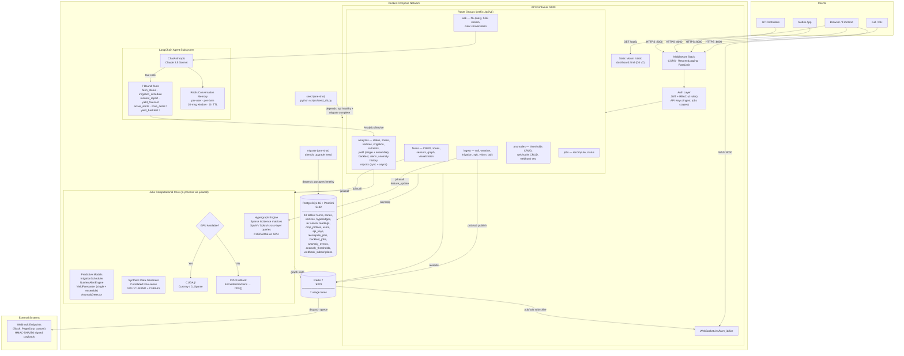

# AgriSense

[](https://github.com/mehdiskouri/agrisense/actions/workflows/ci.yml)
[](LICENSE)
[](https://www.python.org/downloads/release/python-3130/)
[](https://julialang.org/downloads/)

**Agricultural hypergraph API** — models farms as layered hypergraphs with a **GPU-accelerated Julia computational core** (CUDA.jl + KernelAbstractions.jl) for irrigation scheduling, nutrient management, ensemble yield forecasting, anomaly detection, and an LLM-powered natural language query interface. Includes a D3 visualization dashboard, Excel/PDF report generation, webhook-based anomaly alerting, and LangChain agent orchestration with conversational memory.

Built with FastAPI, PostgreSQL 16 + PostGIS, Redis 7, Julia 1.12 via `juliacall`, LangChain + Anthropic Claude, and openpyxl/ReportLab.

> Uses synthetic sensor data modeled on real-world agricultural patterns. Production deployment at Field Partner SARL uses proprietary client data under NDA.

---

## Table of Contents

- [Architecture](#architecture)
- [Layered Hypergraph Model](#layered-hypergraph-model)
- [Quickstart](#quickstart)
- [GPU Setup](#gpu-setup)
- [API Reference](#api-reference)
- [Feature Details](#feature-details)
  - [Ensemble Yield Forecasting](#ensemble-yield-forecasting)
  - [LangChain Agent Orchestration](#langchain-agent-orchestration)
  - [Hypergraph Visualization Dashboard](#hypergraph-visualization-dashboard)
  - [Spreadsheet & PDF Reports](#spreadsheet--pdf-reports)
  - [Anomaly Detection & Webhooks](#anomaly-detection--webhooks)
- [Auth Model](#auth-model)
- [Observability](#observability)
- [Tech Stack](#tech-stack)
- [Project Structure](#project-structure)
- [Demo Queries](#demo-queries)
- [Contributing](#contributing)
- [License](#license)

---

## Architecture


```mermaid
graph TB
    subgraph Clients["Clients"]
        CLI["curl / CLI"]
        Web["Browser / Frontend"]
        Mobile["Mobile App"]
        IoT["IoT Controllers"]
    end

    subgraph DockerCompose["Docker Compose Network"]
        subgraph APIContainer["API Container :8000"]
            direction TB
            MW["Middleware Stack<br/>CORS · RequestLogging · RateLimit"]
            AUTH["Auth Layer<br/>JWT + RBAC (4 roles)<br/>API Keys (ingest, jobs scopes)"]

            subgraph Routes["Route Groups (prefix: /api/v1)"]
                R_FARM["farms — CRUD, zones,<br/>sensors, graph, visualization"]
                R_INGEST["ingest — soil, weather,<br/>irrigation, npk, vision, bulk"]
                R_ANALYTICS["analytics — status, zones,<br/>vertices, irrigation, nutrients,<br/>yield (single + ensemble),<br/>backtest, alerts, anomaly history,<br/>reports (sync + async)"]
                R_ANOMALIES["anomalies — thresholds CRUD,<br/>webhooks CRUD, webhook test"]
                R_ASK["ask — NL query, SSE stream,<br/>clear conversation"]
                R_JOBS["jobs — recompute, status"]
            end

            R_WS["WebSocket /ws/farm_id/live"]
            STATIC["Static Mount /static<br/>dashboard.html (D3 v7)"]
        end

        subgraph LangChainAgent["LangChain Agent Subsystem"]
            LLM["ChatAnthropic<br/>Claude 3.5 Sonnet"]
            TOOLS["7 Bound Tools<br/>farm_status · irrigation_schedule<br/>nutrient_report · yield_forecast<br/>active_alerts · zone_detail ¹<br/>yield_backtest ¹"]
            MEMORY["Redis Conversation Memory<br/>per-user · per-farm<br/>20-msg window · 1h TTL"]
        end

        subgraph JuliaCore["Julia Computational Core (in-process via juliacall)"]
            HG["Hypergraph Engine<br/>Sparse incidence matrices<br/>SpMV / SpMM cross-layer queries<br/>CUSPARSE on GPU"]
            MODELS["Predictive Models<br/>IrrigationScheduler<br/>NutrientAlertEngine<br/>YieldForecaster (single + ensemble)<br/>AnomalyDetector"]
            SYNTH["Synthetic Data Generator<br/>Correlated time-series<br/>GPU: CURAND + CUBLAS"]
            GPU{"GPU Available?"}
            CUDA["CUDA.jl<br/>CuArray / CuSparse"]
            CPU_FB["CPU Fallback<br/>KernelAbstractions → CPU()"]
        end

        PG[("PostgreSQL 16 + PostGIS<br/>:5432<br/>─────────────────<br/>18 tables: farms, zones,<br/>vertices, hyperedges,<br/>6× sensor readings,<br/>crop_profiles, users, api_keys,<br/>recompute_jobs, backtest_jobs,<br/>anomaly_events,<br/>anomaly_thresholds,<br/>webhook_subscriptions")]

        REDIS[("Redis 7<br/>:6379<br/>─────────────────<br/>7 usage lanes")]

        MIGRATE["migrate (one-shot)<br/>alembic upgrade head"]
        SEED["seed (one-shot)<br/>python scripts/seed_db.py"]
    end

    subgraph External["External Systems"]
        WEBHOOKS["Webhook Endpoints<br/>(Slack, PagerDuty, custom)<br/>HMAC-SHA256 signed payloads"]
    end

    CLI & Web & Mobile & IoT -->|"HTTPS :8000"| MW
    Web -->|"WSS :8000"| R_WS
    Web -->|"GET /static"| STATIC

    MW --> AUTH --> Routes
    R_ASK --> LLM
    LLM -->|"tool calls"| TOOLS
    TOOLS -->|"AnalyticsService"| R_ANALYTICS
    LLM --> MEMORY

    R_ANALYTICS & R_FARM -->|"juliacall"| JuliaCore
    R_INGEST -->|"juliacall<br/>feature_update"| HG

    GPU -->|"Yes"| CUDA
    GPU -->|"No"| CPU_FB

    Routes -->|"asyncpg"| PG
    Routes -->|"aioredis"| REDIS
    JuliaCore -.->|"graph state"| REDIS

    R_INGEST -->|"pub/sub publish"| REDIS
    REDIS -->|"pub/sub subscribe"| R_WS

    REDIS -->|"dispatch queue"| WEBHOOKS

    MIGRATE -->|"depends: postgres healthy"| PG
    SEED -->|"depends: api healthy +<br/>migrate complete"| APIContainer

    linkStyle default stroke:#666
```

> ¹ Zone detail and yield backtest tools are feature-flagged via `ask_enable_zone_detail_tool` / `ask_enable_backtest_tool`.

**Redis 7 usage lanes** (all under a single `:6379` instance):

| Lane | Purpose | TTL / Lifecycle |
|---|---|---|
| Graph cache | Cached hypergraph state per farm | Populated at startup, refreshed on ingest |
| Rate limiting | Per-user (100/min) and per-API-key (1000/min) counters | Sliding window |
| Pub/Sub | Live sensor feed from ingest → WebSocket broadcast | Ephemeral |
| Job state | Recompute, backtest, and report job metadata | 6h TTL |
| Report cache | Sync XLSX/PDF report artifact cache | 15-min TTL |
| Conversation memory | LangChain per-user-per-farm chat history | 1h TTL, 20-msg window |
| Webhook dispatch | Anomaly alert dispatch queue for async delivery | Consumed by background worker |

---

## Layered Hypergraph Model

The farm is modeled as `H = (V, E)` where vertices represent physical entities and hyperedges connect arbitrary subsets of vertices across 7 typed layers:

| Layer | Data Source | GPU Operation |
|---|---|---|
| **Soil** | Moisture, temperature, EC, pH sensors (15-min) | SpMV feature aggregation |
| **Irrigation** | Valve state, flow rate, schedule events | Batch water balance kernel |
| **Solar/Lighting** | PAR, DLI, photoperiod (open field + greenhouse) | Broadcasting on CuArray |
| **Weather** | Temperature, humidity, rainfall, wind, ET₀ | Correlated random generation |
| **Crop Requirements** | Growth stage profiles, water/light/NPK needs | Static lookup + GPU scoring |
| **NPK** | Nitrogen, phosphorus, potassium samples | Deficit kernel (KernelAbstractions) |
| **Computer Vision** | Pest/disease/wilting detection from cameras | Stochastic anomaly SpMV |

Vertices span 7 types: `sensor`, `valve`, `crop_bed`, `weather_station`, `camera`, `light_fixture`, `climate_controller`.

Farm profiles (`open_field`, `greenhouse`, `hybrid`) determine which layers are active and which entity types are permitted. Cross-layer queries (e.g., irrigation decision = soil × weather × crop × valve) are expressed as **sparse matrix multiplications** (`B_a' * B_b`) on GPU via CUSPARSE.

---

## Quickstart

```bash
# Clone
git clone https://github.com/mehdiskouri/agrisense.git
cd agrisense

# Copy environment variables
cp .env.example .env

# Start everything (PostgreSQL, Redis, migrations, API, seed data)
docker compose up --build

# API is live at http://localhost:8000
# Swagger docs at http://localhost:8000/docs
# ReDoc at http://localhost:8000/redoc
# Readiness probe at http://localhost:8000/health/ready
# Dashboard at http://localhost:8000/static/dashboard.html
```

Compose orchestration enforces dependency ordering: `postgres` healthy → `migrate` runs → `api` starts → `seed` executes.

### Running inside an existing container (e.g., Vast.ai template)

If the Docker daemon is unavailable inside your workspace shell, use local development mode directly:

```bash
make install       # Python + Julia dependencies
make migrate       # Alembic migrations
make seed          # Synthetic demo data
make dev           # uvicorn with hot reload on :8000
```

### Development commands

```bash
make install       # Install Python (pip) + Julia (Pkg) dependencies
make dev           # Start dev server with hot reload
make migrate       # Run alembic upgrade head
make migrate-new MSG="description"  # Auto-generate migration
make seed          # Seed synthetic demo data
make test          # Python test suite (pytest)
make test-julia    # Julia test suite (Pkg.test)
make test-all      # Both test suites
make lint          # ruff check
make format        # ruff format + ruff check --fix
make typecheck     # mypy app/
make docker-up     # docker compose up --build -d
make docker-down   # docker compose down
make docker-logs   # docker compose logs -f api
make clean         # Remove caches and build artifacts
```

---

## GPU Setup

AgriSense uses **Julia + CUDA.jl + KernelAbstractions.jl** for GPU acceleration. The compute core runs identically on CPU when no GPU is available — `KernelAbstractions` dispatches to the `CPU()` backend automatically.

| Environment | Behavior |
|---|---|
| **Local with NVIDIA GPU** | Automatically detects and uses CUDA |
| **Docker with `--gpus all`** | GPU pass-through via nvidia-container-toolkit |
| **CI — CPU lane** | Falls back to CPU; all tests pass without GPU hardware |
| **CI — GPU lane** | Manual `workflow_dispatch` with `enable_gpu_ci=true`; runs GPU-focused Julia tests on dedicated runner |
| **No GPU available** | KernelAbstractions dispatches to `CPU()` backend transparently |

### Container targets

The Dockerfile uses a multi-stage build: `julia-deps` (Julia 1.12 package precompile) → `python-deps` (pip install) → `runtime-base` → `runtime-cpu` | `runtime-gpu`.

```bash
# CPU runtime image (default, used by docker-compose)
docker build --target runtime-cpu -t agrisense:cpu .

# GPU runtime image (adds NVIDIA env vars)
docker build --target runtime-gpu -t agrisense:gpu .
```

For compose GPU execution, change `api.build.target` to `runtime-gpu` and uncomment `deploy.resources.reservations.devices` in `docker-compose.yml`.

---

## API Reference

All REST endpoints are prefixed with `/api/v1`. Interactive documentation is available at `/docs` (Swagger UI) and `/redoc` (ReDoc).

### System

| Method | Path | Auth | Description |
|---|---|---|---|
| GET | `/health` | None | Liveness probe — returns `{"status": "ok"}` |
| GET | `/health/ready` | None | Deep readiness — checks database, Redis, Julia bridge; returns `200` or `503` |

### Farms

| Method | Path | Auth | Description |
|---|---|---|---|
| POST | `/api/v1/farms` | JWT | Create a farm (type: `open_field` / `greenhouse` / `hybrid`) |
| GET | `/api/v1/farms` | JWT | List all farms |
| GET | `/api/v1/farms/{farm_id}` | JWT | Farm detail with topology summary |
| POST | `/api/v1/farms/{farm_id}/zones` | JWT | Add a zone to a farm |
| POST | `/api/v1/farms/{farm_id}/sensors` | JWT | Register a vertex (sensor, valve, camera, etc.) |
| GET | `/api/v1/farms/{farm_id}/graph` | JWT | Full hypergraph structure (vertices + hyperedges) |
| GET | `/api/v1/farms/{farm_id}/visualization` | JWT | D3-compatible graph visualization payload |

### Ingest

| Method | Path | Auth | Description |
|---|---|---|---|
| POST | `/api/v1/ingest/soil` | API Key (`ingest`) | Batch soil readings |
| POST | `/api/v1/ingest/weather` | API Key (`ingest`) | Weather observations |
| POST | `/api/v1/ingest/irrigation` | API Key (`ingest`) | Irrigation events |
| POST | `/api/v1/ingest/npk` | API Key (`ingest`) | Nutrient samples |
| POST | `/api/v1/ingest/vision` | API Key (`ingest`) | Computer vision inference results |
| POST | `/api/v1/ingest/bulk` | API Key (`ingest`) | Multi-layer bulk ingest |

### Analytics

| Method | Path | Auth | Description |
|---|---|---|---|
| GET | `/api/v1/analytics/{farm_id}/status` | JWT | Aggregate farm status across all zones |
| GET | `/api/v1/analytics/{farm_id}/zones/{zone_id}` | JWT | Zone-level detail with cross-layer links |
| GET | `/api/v1/analytics/{farm_id}/vertices/{vertex_id}` | JWT | Vertex-centric detail |
| GET | `/api/v1/analytics/{farm_id}/irrigation/schedule` | JWT | Irrigation recommendations (configurable horizon) |
| GET | `/api/v1/analytics/{farm_id}/nutrients/report` | JWT | NPK nutrient diagnostics |
| GET | `/api/v1/analytics/{farm_id}/yield/forecast` | JWT | Single-model yield prediction |
| GET | `/api/v1/analytics/{farm_id}/yield/forecast/ensemble` | JWT | Ensemble yield forecast with confidence intervals |
| POST | `/api/v1/analytics/{farm_id}/yield/backtest` | JWT | Synchronous expanding-window backtest |
| POST | `/api/v1/analytics/{farm_id}/yield/backtest/async` | JWT | Enqueue async backtest job |
| GET | `/api/v1/analytics/{farm_id}/yield/backtest/jobs/{job_id}` | JWT | Backtest job status |
| GET | `/api/v1/analytics/{farm_id}/alerts` | JWT | Active alerts and risk indicators |
| GET | `/api/v1/analytics/{farm_id}/anomalies/history` | JWT | Anomaly history with severity/layer/type filters |
| POST | `/api/v1/analytics/{farm_id}/reports/generate` | JWT (`admin`, `agronomist`) | Generate and stream XLSX or PDF report |
| POST | `/api/v1/analytics/{farm_id}/reports/generate/async` | JWT (`admin`, `agronomist`) | Enqueue async report generation job |
| GET | `/api/v1/analytics/{farm_id}/reports/jobs/{job_id}` | JWT (`admin`, `agronomist`) | Report job status |
| GET | `/api/v1/analytics/{farm_id}/reports/jobs/{job_id}/download` | JWT (`admin`, `agronomist`) | Download generated report artifact |

### Ask (Natural Language)

| Method | Path | Auth | Description |
|---|---|---|---|
| POST | `/api/v1/ask/{farm_id}` | JWT | Ask a natural language question about a farm |
| POST | `/api/v1/ask/{farm_id}/stream` | JWT | SSE streaming NL query with token-by-token output |
| DELETE | `/api/v1/ask/{farm_id}/conversation` | JWT | Clear conversation memory for current user + farm |

### Anomalies

| Method | Path | Auth | Description |
|---|---|---|---|
| GET | `/api/v1/anomalies/{farm_id}/thresholds` | JWT | List anomaly detection thresholds |
| POST | `/api/v1/anomalies/{farm_id}/thresholds` | JWT | Create per-sensor-type threshold config |
| PUT | `/api/v1/anomalies/{farm_id}/thresholds/{threshold_id}` | JWT | Update threshold parameters |
| DELETE | `/api/v1/anomalies/{farm_id}/thresholds/{threshold_id}` | JWT | Delete a threshold config |
| GET | `/api/v1/anomalies/{farm_id}/webhooks` | JWT | List webhook subscriptions |
| POST | `/api/v1/anomalies/{farm_id}/webhooks` | JWT | Create webhook subscription |
| PUT | `/api/v1/anomalies/{farm_id}/webhooks/{webhook_id}` | JWT | Update webhook subscription |
| DELETE | `/api/v1/anomalies/{farm_id}/webhooks/{webhook_id}` | JWT | Delete webhook subscription |
| POST | `/api/v1/anomalies/{farm_id}/webhooks/{webhook_id}/test` | JWT | Fire a test webhook delivery |

### Jobs

| Method | Path | Auth | Description |
|---|---|---|---|
| POST | `/api/v1/jobs/{farm_id}/recompute` | API Key (`jobs`) | Enqueue full graph recompute |
| GET | `/api/v1/jobs/{job_id}/status` | API Key (`jobs`) | Check recompute job status |

### WebSocket

| Protocol | Path | Auth | Description |
|---|---|---|---|
| WS | `/ws/{farm_id}/live` | Token in query param | Real-time sensor feed via Redis pub/sub |

### Static Assets

| Method | Path | Description |
|---|---|---|
| GET | `/static/dashboard.html` | Interactive D3 hypergraph visualization dashboard |

---

## Feature Details

### Ensemble Yield Forecasting

Three-member ensemble combining structurally diverse models, each addressing a different aspect of yield dynamics:

| Member | Model | Strength |
|---|---|---|
| FAO thermal-time | Physiological growth model based on accumulated degree-days | Captures biological growth ceilings |
| Exponential smoothing | Time-series trend + seasonality decomposition | Adapts to recent trajectory shifts |
| Quantile regression | Non-parametric distributional estimation | Robust to outliers, produces native quantiles |

- Final forecast is a **weighted quantile combination** — ensemble weights are derived from expanding-window backtest performance.
- Confidence intervals are produced at configurable quantile levels.
- **Backtest** uses expanding-window cross-validation (configurable `n_folds`, minimum `min_history` points per fold).
- Backtest can run synchronously (`POST .../yield/backtest`) or as an async background job (`POST .../yield/backtest/async`) with status polling.
- Julia implementation in `core/AgriSenseCore/src/models/yield.jl`; backtesting logic in `core/AgriSenseCore/src/models/backtesting.jl`.

### LangChain Agent Orchestration

Natural language queries are handled by a **LangChain tool-calling agent** backed by Anthropic Claude 3.5 Sonnet:

- **7 analytics tools** are bound to the agent: `get_farm_status`, `get_irrigation_schedule`, `get_nutrient_report`, `get_yield_forecast`, `get_active_alerts`, `get_zone_detail` (flag-gated), `run_yield_backtest` (flag-gated).
- Each tool calls into `AnalyticsService` → `julia_bridge`, grounding all answers in observable data.
- **Conversation memory** is per-user, per-farm, stored in Redis with a 1-hour TTL and 20-message sliding window. Falls back to in-memory storage if Redis is unavailable.
- **SSE streaming** endpoint (`POST /api/v1/ask/{farm_id}/stream`) delivers token-by-token output.
- **Cost tracking** via configurable `anthropic_input_cost_usd_per_million` / `anthropic_output_cost_usd_per_million`.
- Conversation can be explicitly cleared via `DELETE /api/v1/ask/{farm_id}/conversation`.

### Hypergraph Visualization Dashboard

Interactive browser-based visualization of the farm hypergraph:

- **Static HTML** served at `/static/dashboard.html` — no build step, loads D3 v7 from CDN.
- **API payload** at `GET /api/v1/farms/{farm_id}/visualization` returns D3-compatible JSON (nodes + links with layer metadata).
- **Force-directed layout** with layer-colored nodes, edge bundling by hyperedge membership.
- **Click-to-inspect** — selecting a node displays vertex metadata, connected hyperedges, and layer statistics.
- Farm ID is passed as a URL query parameter; dashboard fetches data from the API on load.

### Spreadsheet & PDF Reports

Downloadable reports aggregating farm analytics into formatted documents:

- **XLSX** (via `openpyxl`): Multi-sheet workbook — farm overview, irrigation schedule, nutrient report, yield forecast (with ensemble members), active alerts. Styled headers, conditional formatting on anomaly severity, embedded charts for history series.
- **PDF** (via `reportlab`): Compact summary for quick sharing.
- **Sync delivery**: `POST .../reports/generate` streams the file directly. Cached in Redis for 15 minutes (key: `farm_id` + request payload hash + format).
- **Async delivery**: `POST .../reports/generate/async` enqueues a background job. Poll status, then download the artifact. Job metadata and files stored in Redis with 6-hour TTL.
- Report content is configurable: `irrigation_horizon_days`, `include_members` (ensemble breakdown), `include_history_charts`.

### Anomaly Detection & Webhooks

Enhanced anomaly detection with configurable sensitivity, severity classification, and external notification:

- **Severity classification**: Every anomaly event is tagged `info`, `warning`, or `critical` (`AnomalySeverityEnum`).
- **Per-sensor-type thresholds**: Configurable sigma thresholds (`sigma1`/`sigma2`/`sigma3`), minimum history length, NaN-run outage detection, vision anomaly score threshold, and rule suppression — all tunable per farm, per vertex type, and per layer via CRUD endpoints.
- **Anomaly history**: Queryable via `GET .../anomalies/history` with filters on severity, layer, vertex, anomaly type, and time range (with pagination).
- **Webhook subscriptions**: Full CRUD lifecycle for external notification endpoints. Each subscription has a unique secret used for **HMAC-SHA256 payload signing** so receivers can verify authenticity.
- **Async dispatch**: Anomaly events are pushed to a Redis dispatch queue and delivered by a background worker with configurable retry (`retry_max` per subscription, default 3).
- **Test endpoint**: `POST .../webhooks/{id}/test` fires a synthetic delivery to verify connectivity.

---

## Auth Model

AgriSense supports two authentication mechanisms, enforced per-endpoint:

### JWT (Bearer Token)

- RBAC with 4 roles: `admin`, `agronomist`, `field_operator`, `readonly`.
- Access/refresh token pair. Default expiry: 30 min access / 7 day refresh.
- Report endpoints restricted to `admin` and `agronomist`.

### API Keys

- Header-based (`x-api-key`).
- Scoped: `ingest` (sensor data ingestion) and `jobs` (recompute/backtest enqueue).
- Validated via SHA-256 digest (fast path) or bcrypt (legacy fallback).

---

## Observability

- **Structured logging** via `structlog` — JSON or console format configurable via `log_format`.
- **Request IDs** propagated via `x-request-id` header, echoed on all responses.
- **Request logs** capture method, path, status code, and duration for every request.
- **Julia bridge timing** — per-call instrumentation for all analytics and ingestion operations.
- **Health probes**:
  - `/health` — lightweight liveness (always returns `200`).
  - `/health/ready` — deep readiness checking database connectivity, Redis ping, and Julia bridge initialization status. Returns `503` if any subsystem is unhealthy.

---

## Tech Stack

| Component | Technology | Version |
|---|---|---|
| API Framework | FastAPI + Uvicorn | Python 3.13 |
| Compute Core | Julia + CUDA.jl + KernelAbstractions.jl | Julia 1.12 |
| Database | PostgreSQL + PostGIS + GeoAlchemy2 | PostgreSQL 16 |
| Cache / PubSub / Queues | Redis | Redis 7 |
| ORM + Migrations | SQLAlchemy 2.0 (async) + Alembic | asyncpg driver |
| NL Agent | LangChain + langchain-anthropic + langchain-community | Claude 3.5 Sonnet |
| Spreadsheet Reports | openpyxl + ReportLab | XLSX + PDF |
| Visualization | D3.js (CDN) | v7 |
| Auth | python-jose (JWT) + passlib (bcrypt) | HS256 |
| Julia Bridge | juliacall | in-process FFI |
| Observability | structlog | JSON structured logs |
| Webhook Signing | HMAC-SHA256 | per-subscription secret |
| HTTP Client | httpx | async |
| Validation + Config | Pydantic v2 + pydantic-settings | `.env` sourced |
| CI | GitHub Actions | lint, test, julia-test, docker-build, gpu-test |
| Container | Docker (multi-stage) + docker-compose | cpu / gpu targets |

---

## Project Structure

```
agrisense/
├── app/                              # Python API layer
│   ├── main.py                       # FastAPI app, lifespan, middleware, router registration
│   ├── config.py                     # pydantic-settings (all env-sourced configuration)
│   ├── database.py                   # Async SQLAlchemy engine + session factory
│   ├── auth/
│   │   ├── dependencies.py           # JWT + API key auth dependencies, RBAC enforcement
│   │   ├── jwt.py                    # Token creation + validation
│   │   └── models.py                 # User + APIKey ORM models
│   ├── contracts/
│   │   └── jsonb.py                  # JSONB type helpers
│   ├── middleware/
│   │   ├── logging.py                # RequestLoggingMiddleware (x-request-id, timing)
│   │   └── rate_limit.py             # RateLimitMiddleware (per-user + per-API-key)
│   ├── models/
│   │   ├── base.py                   # UUIDMixin, TimestampMixin
│   │   ├── enums.py                  # All StrEnum types (10 enums)
│   │   ├── farm.py                   # Farm, Zone, Vertex, HyperEdge
│   │   ├── sensors.py                # SoilReading, WeatherReading, IrrigationEvent, NpkSample, VisionEvent, LightingReading
│   │   ├── crops.py                  # CropProfile
│   │   ├── jobs.py                   # RecomputeJob, BacktestJob
│   │   └── anomalies.py             # AnomalyEvent, AnomalyThreshold, WebhookSubscription
│   ├── schemas/
│   │   ├── farm.py                   # Farm/Zone/Vertex/Graph request + response schemas
│   │   ├── ingest.py                 # Ingest request + receipt schemas (all 6 layers + bulk)
│   │   ├── analytics.py              # Status, irrigation, nutrient, yield, ensemble, backtest, report schemas
│   │   ├── anomalies.py              # Threshold, webhook, anomaly history schemas
│   │   ├── ask.py                    # AskRequest, AskResponse
│   │   ├── jobs.py                   # Job create + status schemas
│   │   └── reports.py                # ReportRequest schema
│   ├── routes/
│   │   ├── farms.py                  # 7 endpoints: CRUD, zones, sensors, graph, visualization
│   │   ├── ingest.py                 # 6 endpoints: soil, weather, irrigation, npk, vision, bulk
│   │   ├── analytics.py              # 16 endpoints: status, zones, vertices, irrigation, nutrients, yield, ensemble, backtest, alerts, anomaly history, reports
│   │   ├── anomalies.py              # 9 endpoints: thresholds CRUD, webhooks CRUD, webhook test
│   │   ├── ask.py                    # 3 endpoints: ask, stream, clear conversation
│   │   ├── jobs.py                   # 2 endpoints: recompute, status
│   │   └── ws.py                     # WebSocket live feed (/ws/{farm_id}/live)
│   ├── services/
│   │   ├── analytics_service.py      # Aggregation, scheduling, forecasting, anomaly history, visualization payloads
│   │   ├── farm_service.py           # Farm/zone/vertex CRUD, layer activation, graph assembly
│   │   ├── ingest_service.py         # Validation, persistence, pub/sub publish, feature updates
│   │   ├── jobs_service.py           # Recompute job lifecycle
│   │   ├── llm_service.py            # LangChain agent (ChatAnthropic + tool binding + memory)
│   │   ├── agent_tools.py            # 7 LangChain tool definitions (build_tools factory)
│   │   ├── conversation_memory.py    # Redis-backed chat history (per-user-per-farm, TTL, windowing)
│   │   ├── anomaly_service.py        # Threshold CRUD, anomaly event persistence, history queries
│   │   ├── webhook_service.py        # Webhook CRUD, HMAC-SHA256 dispatch, background queue worker
│   │   ├── report_service.py         # XLSX/PDF generation, sync cache, async job lifecycle
│   │   ├── julia_bridge.py           # Runtime bridge to Julia AgriSenseCore (graph, models, synthetic)
│   │   ├── julia_contracts.py        # TypedDict payload contracts for Julia boundary
│   │   └── julia_validators.py       # Runtime validators for dynamic Julia payloads
│   └── static/
│       └── dashboard.html            # D3 v7 force-directed hypergraph visualization
├── core/AgriSenseCore/               # Julia GPU compute package
│   ├── Project.toml                  # Julia package manifest
│   ├── src/
│   │   ├── AgriSenseCore.jl          # Module entry + GPU backend selection
│   │   ├── types.jl                  # FarmProfile, HyperGraphLayer, vertex/edge structs
│   │   ├── hypergraph.jl             # build, query, cross_layer (SpMV/SpMM on GPU)
│   │   ├── bridge.jl                 # Python-facing API (Dict in/out, GPU internal)
│   │   ├── models/
│   │   │   ├── irrigation.jl         # IrrigationScheduler
│   │   │   ├── nutrients.jl          # NutrientAlertEngine
│   │   │   ├── yield.jl              # YieldForecaster (single + ensemble)
│   │   │   ├── backtesting.jl        # Expanding-window backtest harness
│   │   │   └── anomaly.jl            # AnomalyDetector
│   │   └── synthetic/
│   │       ├── generator.jl          # Orchestrator for all synthetic layers
│   │       ├── correlations.jl       # Cross-layer correlation modeling
│   │       ├── soil.jl               # Soil moisture/temp/EC/pH generation
│   │       ├── weather.jl            # Weather time-series (temp, humidity, rain, wind, ET₀)
│   │       ├── lighting.jl           # PAR, DLI, photoperiod
│   │       ├── npk.jl                # NPK nutrient sample generation
│   │       └── vision.jl             # Synthetic pest/disease/wilting events
│   └── test/                         # Julia test suite (11 test files)
├── alembic/                          # Database migrations
│   ├── env.py
│   ├── script.py.mako
│   └── versions/
│       ├── 506ed2dedad4_initial_schema.py
│       ├── 8b2f4c1a9d77_add_recompute_jobs.py
│       ├── c3a1b9d2e4f6_add_backtest_jobs.py
│       └── d91a6e7b4c20_add_anomaly_detection_enhancements.py
├── scripts/
│   ├── init_db.sql                   # PostgreSQL initialization (extensions, roles)
│   ├── seed_db.py                    # Synthetic data seeder
│   └── demo_queries.sh              # curl walkthrough for major endpoints
├── tests/                            # Python test suite (12 test files)
├── .github/workflows/ci.yml         # CI: lint, python-test, julia-test, docker-build, julia-gpu-test
├── Dockerfile                        # Multi-stage: julia-deps → python-deps → runtime-base → cpu|gpu
├── docker-compose.yml               # postgres + redis + migrate + api + seed
├── Makefile                          # 14 targets: dev, test, lint, migrate, docker-up, etc.
├── pyproject.toml                    # Python package config + tool settings (ruff, mypy)
├── alembic.ini                       # Alembic configuration
├── architectural_decisions_record.md  # Architecture Decision Record (17 decisions)
├── CONTRIBUTING.md                   # Development setup + contribution guidelines
└── LICENSE                           # MIT
```

---

## Demo Queries

Scripted curl walkthroughs are provided in `scripts/demo_queries.sh`. Configure before running:

```bash
export BASE_URL=http://localhost:8000
export AUTH_TOKEN=<your-jwt-token>
export API_KEY=<your-api-key>
export FARM_ID=<your-farm-uuid>

bash scripts/demo_queries.sh
```

---

## Contributing

See `CONTRIBUTING.md` for:
- Development environment setup (Python 3.13+, Julia 1.12+)
- GPU development with NVIDIA + CUDA toolkit
- Julia bridge architecture and data contract conventions
- Step-by-step guides for adding new hypergraph layers and predictive models
- CI expectations (ruff, mypy, pytest, Julia tests, Docker smoke checks, GPU lane)

---

## License

[MIT](LICENSE)
